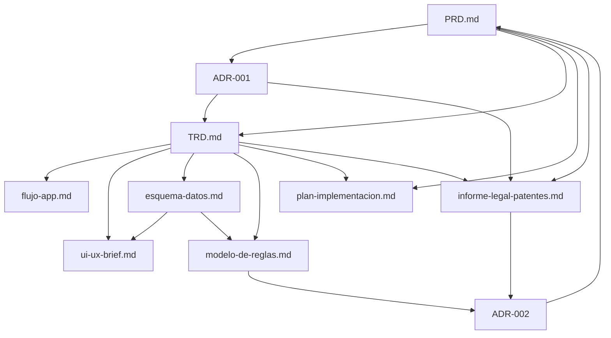

# Índice de documentación — Alcaide (Filtro de Inyección de Prompts en Rust)

Este proyecto nace de la idea #29 de `Ideas_Rust.md`. Estos son todos los documentos generados hasta ahora, en el orden en que conviene leerlos.

## 1. Producto y decisión

- **[`PRD.md`](./PRD.md)** — Qué se construye, para quién, y por qué. Incluye el panorama competitivo (Lakera, Rebuff, LLM Guard, NeMo, Bedrock, JailGuard) y los cuatro diferenciadores del proyecto.
- **[`ADR-001-eleccion-lenguaje-rust.md`](./ADR-001-eleccion-lenguaje-rust.md)** — Por qué Rust y no Python: qué diferenciadores dependen del lenguaje, justificación técnica adicional (ReDoS, GC, distribución), y trade-offs aceptados conscientemente.

## 2. Especificación técnica

- **[`TRD.md`](./TRD.md)** — Arquitectura del sistema, stack tecnológico, contrato de la API, requisitos no funcionales y cómo se verifican.
- **[`modelo-de-reglas.md`](./modelo-de-reglas.md)** — Cómo funciona técnicamente el motor de reglas deterministas, el modelo de tres capas (Core/Sector/Custom) y quién genera y mantiene cada una.
- **[`esquema-datos.md`](./esquema-datos.md)** — Esquema del archivo de configuración de reglas y del log de decisión JSON.

## 3. Experiencia y flujo

- **[`flujo-app.md`](./flujo-app.md)** — Flujo de decisión en tiempo de ejecución y flujo de adopción del desarrollador.
- **[`ui-ux-brief.md`](./ui-ux-brief.md)** — Developer Experience: archivo de reglas, CLI, API, formato de logs.

## 4. Ejecución

- **[`plan-implementacion.md`](./plan-implementacion.md)** — Hitos M0-M11 de la Fase 1, con dependencias y criterios de completitud.

## 5. Legal y negocio

- **[`informe-legal-patentes.md`](./informe-legal-patentes.md)** — Panorama de patentes activas en EE.UU. sobre mitigación de prompt injection (Preamble, HiddenLayer), evaluación preliminar contra el diseño de Fase 1, y recomendación de análisis FTO profesional antes de la Fase 2 o de cualquier lanzamiento comercial.
- **[`ADR-004-licenciamiento-dual-agpl-comercial.md`](./ADR-004-licenciamiento-dual-agpl-comercial.md)** — **Decisión final de licenciamiento:** open core con AGPLv3 (Core) + licencia comercial separada (capa paga), patrón MinIO. Reemplaza a `ADR-002`. Incluye la corrección legal de por qué AGPL no puede obligar a compartir reglas custom.
- **[`ADR-002-estrategia-propiedad-intelectual.md`](./ADR-002-estrategia-propiedad-intelectual.md)** — Superado por `ADR-004`. Se mantiene por su análisis de mecanismos de protección de IP (patente/copyright/secreto comercial/marca/contrato), aún válido como referencia.
- **[`ADR-003-mecanismo-de-contribucion-de-reglas.md`](./ADR-003-mecanismo-de-contribucion-de-reglas.md)** — Mecanismo opt-in (`alcaide contribute`) para compartir reglas — es, legalmente, la única vía posible para lograr ese objetivo dado lo explicado en `ADR-004`, ya que AGPL no puede exigirlo.

## Mapa de dependencias entre documentos

## Estado general del proyecto

- Fase actual: definición (Fase 1 del roadmap del PRD aún no iniciada en código).
- **Resuelto:** modelo de negocio y licenciamiento final — open core con licenciamiento dual: **AGPLv3** para la capa Core, **licencia comercial separada** para la capa Sector/plataforma (`ADR-004-licenciamiento-dual-agpl-comercial.md`). Compartir reglas custom es voluntario (`ADR-003`), no exigible por la licencia.
- **Resuelto:** nombre del proyecto confirmado como **Alcaide** (1 sept 2026).
- Pendiente de tu decisión (ver `PRD.md` sección 12): modalidad de venta (suscripción vs. plataforma vs. ambas), y búsqueda formal de marca registrada antes de anunciar públicamente el nombre.
- Pendiente técnico identificado en `modelo-de-reglas.md` sección 7: extender `esquema-datos.md` y `TRD.md` para soportar múltiples archivos de reglas combinables (Core + Sector + Custom) — hoy esos documentos asumen un solo archivo plano.
- Pendiente legal, ahora prioritario dado que hay intención comercial confirmada: encargar un análisis de libertad de operación (FTO) profesional antes de iniciar la Fase 2 (clasificador ML embebido), dado el solapamiento potencial con la patente US12130917B1 de HiddenLayer (`informe-legal-patentes.md` sección 3), y redactar ToS/EULA para la capa comercial (`ADR-002` próximos pasos).
