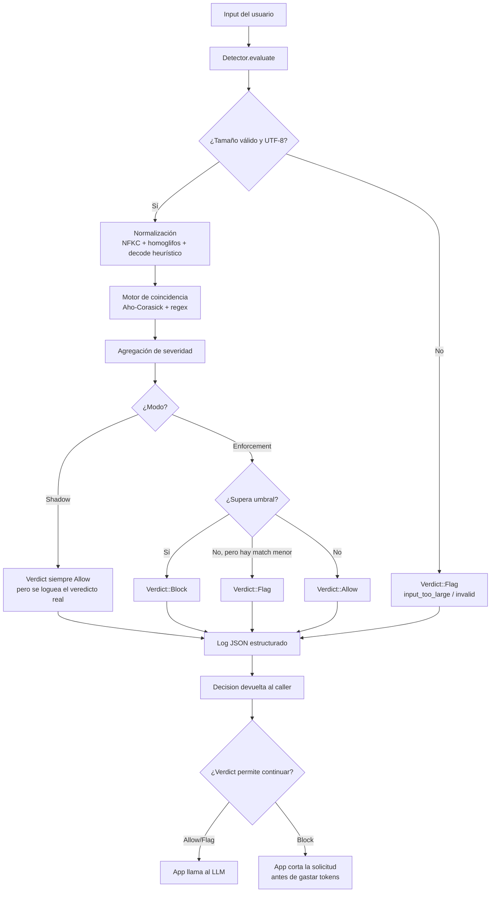
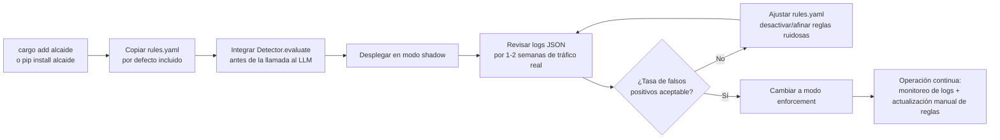

# Flujo de la aplicación — Alcaide

**Estado:** Borrador v0.1 — 30 ago 2026
**Documentos relacionados:** [`README.md`](./README.md) (índice) · [`TRD.md`](./TRD.md) (arquitectura del pipeline de detección referenciado en el flujo A) · [`PRD.md`](./PRD.md) (contexto de producto)

Alcaide no tiene pantallas — es una librería/CLI. El equivalente real a un "flujo de app" aquí son dos recorridos distintos: **(A)** cómo viaja un prompt por el pipeline de decisión en tiempo de ejecución, y **(B)** cómo un desarrollador adopta la herramienta desde cero hasta producción. Ambos son necesarios para entender el producto completo.

## A. Flujo de decisión en tiempo de ejecución

**Puntos clave del flujo A:**

- El modo **shadow** nunca bloquea — solo registra qué habría pasado. Esto existe para que un equipo pueda calibrar el motor de reglas contra tráfico real antes de arriesgarse a bloquear tráfico legítimo (mitiga el riesgo de falsos positivos identificado en el PRD, sección 10).
- `Flag` es un estado intermedio deliberado: no bloquea, pero deja registro para revisión humana o para alimentar la curación de reglas futuras — no todo tiene que ser binario ALLOW/BLOCK.
- El costo en tokens del LLM solo se evita cuando el `Verdict::Block` ocurre **antes** de la llamada al proveedor — esto es la propuesta de valor central del PRD (sección 2) y por eso el pipeline entero corre en el proceso del caller, sin round-trip de red.

## B. Flujo de adopción del desarrollador

**Puntos clave del flujo B:**

- El paso de **shadow → enforcement** es intencionalmente manual y gatillado por el propio equipo adoptante, no automático — esto es coherente con la honestidad sobre limitaciones que definimos en el PRD (nadie debería activar bloqueo real sin haber visto cómo se comporta el motor contra su tráfico específico).
- En Fase 1 no hay actualización automática de reglas (eso requeriría infraestructura de distribución que está fuera de alcance) — el mantenimiento del `rules.yaml` es responsabilidad del equipo adoptante, con el set por defecto de Alcaide como punto de partida curado.
- Este flujo asume integración por librería/CLI (Fase 1). El flujo equivalente para el filtro WASM de infraestructura (Fase 3) tendrá pasos distintos (configuración a nivel de Envoy/Istio en vez de código de aplicación) y se documentará cuando esa fase se aborde.

## Fuera de alcance de este documento

No hay flujo de usuario final (persona que escribe el prompt) porque Alcaide es invisible para esa persona — solo interactúa con el desarrollador/operador que lo integra. Si en el futuro existe un dashboard (fuera de alcance de Fase 1 según el PRD), ese flujo se documentará por separado.
