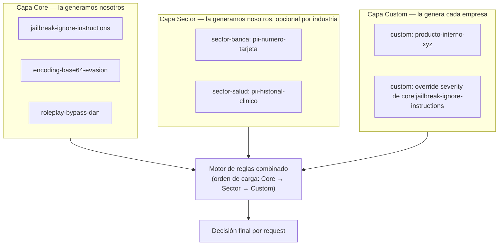

# Informe — Modelo técnico y de gobernanza del motor de reglas

**Estado:** Borrador v0.1 — 31 ago 2026
**Responde a:** ¿cómo se resuelve técnicamente la lista de reglas deterministas? ¿es distinta para cada empresa? ¿existen sets genéricos por sector? ¿quién las genera?
**Documentos relacionados:** [`README.md`](./README.md) (índice) · [`TRD.md`](./TRD.md) (arquitectura del motor) · [`esquema-datos.md`](./esquema-datos.md) (esquema base de `rules.yaml`, que este informe extiende) · [`PRD.md`](./PRD.md) (propuesta de valor de la que depende este modelo)

## 1. Resumen ejecutivo

Un solo archivo `rules.yaml` universal para todas las empresas no funciona: lo que es una amenaza crítica para un banco (alguien pidiendo el número de una tarjeta) es irrelevante para una app de recetas de cocina, y lo que es ruido aceptable para una startup puede ser inaceptable para un hospital. La solución no es "una lista para todos" ni "cada empresa empieza de cero" — es un **modelo de tres capas que se combinan**, con autoría y mantenimiento distintos en cada capa. Esta sección resume el modelo; el resto del informe lo detalla.

| Capa | Contenido | Quién la genera | Quién la mantiene |
|---|---|---|---|
| **Core (base universal)** | Ataques genéricos de jailbreak/prompt injection, válidos para cualquier dominio | Nosotros (el proyecto) | Nosotros, con el proyecto open source |
| **Sector (packs opcionales)** | Amenazas típicas de una industria (banca, salud, gobierno, retail) | Nosotros, como oferta adicional | Nosotros, con input de la comunidad/clientes del sector |
| **Custom (por empresa)** | Términos, productos y contexto propios de cada negocio | Cada empresa adoptante | Cada empresa adoptante |

## 2. El mecanismo técnico de una regla, en detalle

Retomando la analogía del guardia con una lista escrita: cada línea de esa lista, en términos técnicos, es un objeto `Rule` como el que ya definimos en `esquema-datos.md`:

```yaml
- id: pii-numero-tarjeta-credito
  category: exfiltration
  severity: critical
  pattern_type: regex
  pattern: "\\b(?:\\d[ -]*?){13,16}\\b"
  enabled: true
  notes: "Detecta secuencias con forma de número de tarjeta en el input del usuario"
```

Cuando llega un mensaje, el motor (descrito en `TRD.md`, sección 3) recorre **todas** las reglas activas de forma simultánea usando Aho-Corasick/regex, y si alguna coincide, la decisión final incluye exactamente qué regla se disparó, con qué severidad y en qué posición del texto — eso es lo que hace posible responder "¿por qué se bloqueó esto?" con una razón concreta, no un puntaje.

La pregunta real detrás de tu consulta no es "cómo funciona una regla" (eso ya está resuelto) sino: **¿de dónde sale el contenido completo de esa lista, y es la misma lista para todos los clientes?** Eso es lo que resuelve el modelo de capas.

## 3. Por qué no basta una sola lista universal

Tres ejemplos concretos muestran el problema:

- Un banco necesita bloquear intentos de extraer números de tarjeta o instrucciones de transferencia — una tienda de e-commerce de bajo riesgo probablemente no necesita esa regla activa (podría generar falsos positivos si un cliente legítimo pregunta por el estado de su pago).
- Un hospital necesita bloquear intentos de extraer historiales clínicos de pacientes — un banco no tiene ese vector de riesgo en absoluto.
- Una empresa de defensa/gobierno necesita bloquear intentos de extraer información clasificada con terminología específica de su dominio (nombres de programas internos, códigos de proyecto) — eso es imposible de anticipar para nosotros como proveedores del producto, porque no tenemos visibilidad de su vocabulario interno.

Esto confirma la respuesta a "¿quién las genera?": **no puede ser una sola parte** — ni nosotros podemos anticipar el vocabulario interno de cada empresa, ni cada empresa debería tener que reinventar desde cero las reglas genéricas de jailbreak que son las mismas para todo el mundo.

## 4. El modelo de tres capas



### 4.1 Capa Core — la generamos nosotros

Es el `rules.yaml` por defecto descrito en `plan-implementacion.md` (hito M6): patrones de jailbreak conocidos, curados desde corpus públicos (JailbreakBench y equivalentes citados en la investigación de mercado). Toda empresa que use Alcaide parte con esta capa activa. Se distribuye y actualiza como parte del proyecto — igual que una base de firmas de antivirus, o como el **OWASP ModSecurity Core Rule Set (CRS)**, que es exactamente este mismo patrón aplicado a firewalls de aplicaciones web desde hace más de una década: un set base mantenido por la comunidad, más la posibilidad de que cada sitio agregue sus propias reglas.

### 4.2 Capa Sector — la generamos nosotros, como oferta adicional

Packs opcionales activables por industria: `rules-sector-banca.yaml`, `rules-sector-salud.yaml`, `rules-sector-gobierno.yaml`, etc. Ejemplo de contenido de un pack de banca:

```yaml
# rules-sector-banca.yaml
version: 1
layer: sector
sector: banca
rules:
  - id: pii-numero-tarjeta-credito
    category: exfiltration
    severity: critical
    pattern_type: regex
    pattern: "\\b(?:\\d[ -]*?){13,16}\\b"
    notes: "Secuencia con forma de número de tarjeta"

  - id: solicitud-transferencia-no-autorizada
    category: injection-generic
    severity: high
    pattern_type: regex
    pattern: "(transfiere|env[ií]a)\\s+(todo|\\$?\\d+)\\s+a\\s+la\\s+cuenta"
    notes: "Patrón de instrucción de transferencia inyectada en el prompt"
```

Ejemplo equivalente para salud:

```yaml
# rules-sector-salud.yaml
version: 1
layer: sector
sector: salud
rules:
  - id: pii-historial-clinico
    category: exfiltration
    severity: critical
    pattern_type: regex
    pattern: "(historial|ficha)\\s+(cl[ií]nic[oa]|m[eé]dic[oa])\\s+(completo|de\\s+todos)"
    notes: "Intento de solicitar volcado de datos clínicos vía el chatbot"
```

Estos packs los generamos y mantenemos nosotros porque las amenazas típicas de un sector se repiten entre empresas del mismo rubro — no tiene sentido que cada banco reinvente la misma regla de "detectar números de tarjeta". Es, además, un candidato natural para monetización (packs sectoriales de pago sobre un core gratuito) — conecta con la pregunta abierta de monetización del `PRD.md`, sección 12.

### 4.3 Capa Custom — la genera cada empresa

Contexto específico del negocio que nosotros no podemos conocer:

```yaml
# rules-custom-empresa.yaml
version: 1
layer: custom
rules:
  - id: producto-interno-proyecto-fenix
    category: injection-generic
    severity: high
    pattern_type: literal
    pattern: "Proyecto Fénix"
    notes: "Nombre en clave de producto no público, mencionado indebidamente filtraría roadmap interno"

overrides:
  - ref: core:jailbreak-ignore-instructions
    enabled: false
    notes: "Desactivada: genera falsos positivos en nuestro caso de uso de chatbot educativo sobre seguridad de IA"
```

Nota el bloque `overrides`: una empresa puede **desactivar o ajustar una regla de una capa inferior sin modificar el archivo original** — referencia el id completo (`core:jailbreak-ignore-instructions`) y solo declara el campo que cambia. Esto evita que cada empresa tenga que mantener un fork completo del archivo base cada vez que nosotros lo actualicemos.

## 5. Mecanismo técnico de combinación (merge)

Extiende lo definido en `esquema-datos.md`, sección 1:

1. **Orden de carga fijo:** Core → Sector (0 o más packs) → Custom. Cada capa puede agregar reglas nuevas o hacer *override* de reglas de una capa anterior — nunca al revés.
2. **IDs completamente calificados:** cada regla se identifica internamente como `<capa>:<id>` (ej. `core:jailbreak-ignore-instructions`, `sector-banca:pii-numero-tarjeta-credito`, `custom:producto-interno-proyecto-fenix`) — esto evita colisiones accidentales entre capas.
3. **Detección de conflictos en tiempo de carga:** si dos archivos definen el mismo id nuevo (no como `override`, sino como definición duplicada), `alcaide lint-rules` (ver `ui-ux-brief.md`, sección 3) falla con un error explícito en vez de aplicar un comportamiento ambiguo silencioso.
4. **Los `overrides` son parches, no redefiniciones completas** — solo pueden tocar `enabled` y `severity`, no pueden cambiar el `pattern` de una regla de una capa inferior (si una empresa necesita un patrón distinto, debe desactivar la regla base y crear una propia en su capa custom — así queda explícito en el log de decisión qué regla exacta actuó).

Esto es una extensión al esquema de `esquema-datos.md` que aún no está implementada en el TRD actual — queda como tarea pendiente de incorporar formalmente (ver sección 7).

## 6. Ciclo de vida de una regla custom (flujo operativo real)

1. Un ingeniero de seguridad de la empresa adoptante ve, en modo shadow (`flujo-app.md`, flujo B), un intento de ataque que las capas Core/Sector no cubrieron.
2. Escribe una regla nueva en su archivo custom — no necesita saber Rust ni tocar el motor, solo editar YAML.
3. Corre `alcaide bench` (ver `ui-ux-brief.md`, sección 3) contra su propio corpus de prueba para verificar que la regla nueva no genera falsos positivos.
4. Activa la regla (`enabled: true`) y la despliega.

Esto es, en sí mismo, parte del argumento de venta del enfoque determinista sobre el enfoque de ML puro (`PRD.md`, sección 5, punto 1): reaccionar a un ataque nuevo es editar una línea de texto y desplegar, no reentrenar un modelo.

### 6.1 Contribución opcional de vuelta al proyecto

Ampliando el flujo anterior: si el ingeniero de seguridad considera que la regla nueva que escribió es lo suficientemente genérica como para ser útil para otros clientes (no contiene información sensible propia), puede compartirla de vuelta de forma **explícita y voluntaria** mediante `alcaide contribute` — nunca automático, ver [`ADR-003-mecanismo-de-contribucion-de-reglas.md`](./ADR-003-mecanismo-de-contribucion-de-reglas.md) para el detalle completo de por qué se descartó una obligación contractual de compartir y qué mecanismo se adoptó en su lugar.

## 7. Próximos pasos técnicos

Este informe define el modelo de tres capas y su mecanismo de merge a nivel conceptual. Falta, como trabajo técnico pendiente:

- Extender `esquema-datos.md` con el campo `layer` y la sección `overrides` formalmente (hoy solo describe un único archivo plano).
- Extender `TRD.md` sección 4 (contrato de la API) para que `Detector::from_config_path` acepte múltiples rutas o un directorio de reglas en vez de un solo archivo.
- Agregar un hito al `plan-implementacion.md` para esta funcionalidad de merge — no estaba contemplada en M1 original, que asumía un solo archivo de config.

No se modificaron esos documentos en este informe para no mezclar la definición conceptual (este documento) con el detalle de implementación — quedan como una actualización pendiente y explícita, a confirmar contigo antes de aplicarla.
